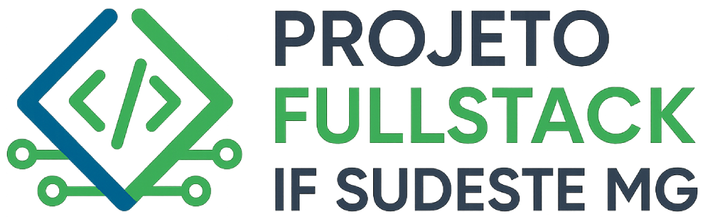

# Projeto final - Engenharia de Software - Pós-graduação Full Stack - IF Sudeste MG

Esta aplicação é uma simulação de cadastro de pessoa, cadastro de empresa, funcionário (associação de pessoa com empresa) e endereço (associação de pessoa com endereço).

## Autores
- [@jrmessias](https://www.github.com/jrmessias) Israel Aparecido Messias Junior

## Versões
Versão utilizada do Node.js: 24.7.0
* Especificada nos arquivos .node-version e .nvmrc

## Stack utilizada
**Front-end:**
- Node.js
- Http server
- Jest
- Puppeteer
- Bootstrap

**Back-end:**
- Node.js
- Express
- Jest
- Axios

## Documentação
Este projeto possui duas pastas sendo:

backend:

frontend:

## Instalação

Instale o projeto com npm em cada pasta, conforme orientações abaixo:

Na pasta do backend:
```bash
  cd backend
  npm install
```
 É necessário voltar a pasta anterior `cd..` (Linux) ou `cd ..` (Windows) e depois entrar na pasta do frontend:
```bash
  cd frontend
  npm install
```

## Variáveis de Ambiente

Para rodar esse projeto, você vai precisar adicionar as seguintes variáveis de ambiente no seu .env

`API_KEY`

`ANOTHER_API_KEY`

## Rodando os testes

Para rodar os testes, rode o seguinte comando

```bash
  npm run test
```

Para verificar a cobertura dos testes, rode o seguinte comando

```bash
  npm run test:coverage
```

## Documentação da API

#### Retorna todos os itens

```http
  GET /api/items
```

| Parâmetro   | Tipo       | Descrição                           |
| :---------- | :--------- | :---------------------------------- |
| `api_key` | `string` | **Obrigatório**. A chave da sua API |

#### Retorna um item

```http
  GET /api/items/${id}
```

| Parâmetro   | Tipo       | Descrição                                   |
| :---------- | :--------- | :------------------------------------------ |
| `id`      | `string` | **Obrigatório**. O ID do item que você quer |

#### add(num1, num2)

Recebe dois números e retorna a sua soma.

